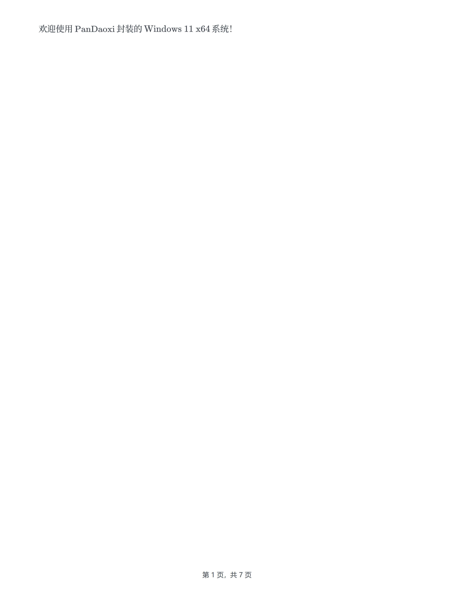
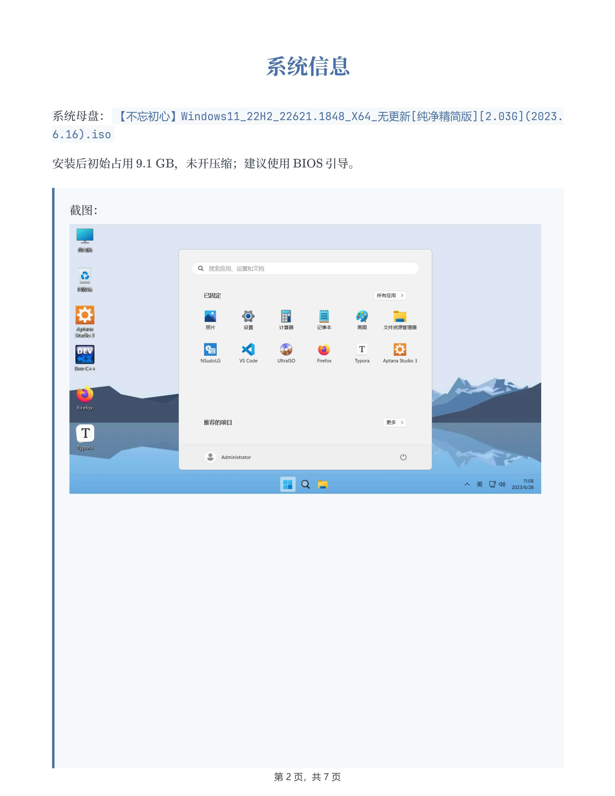
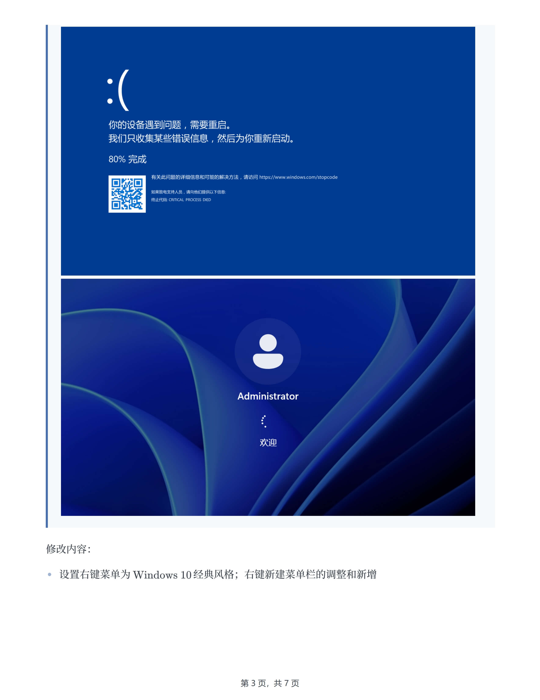
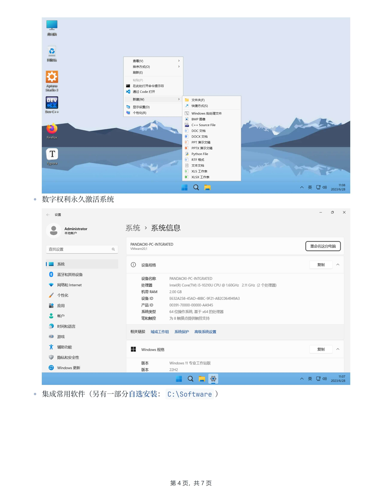
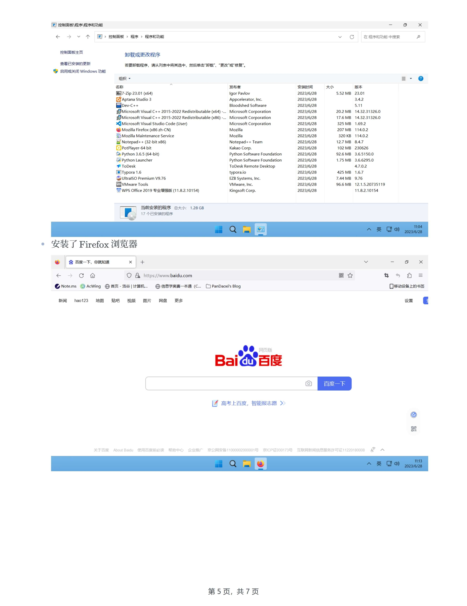
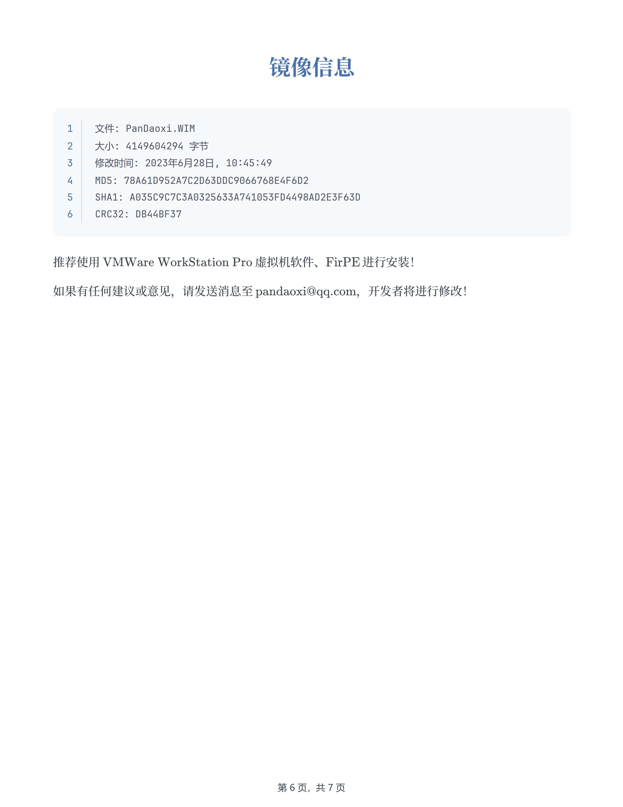
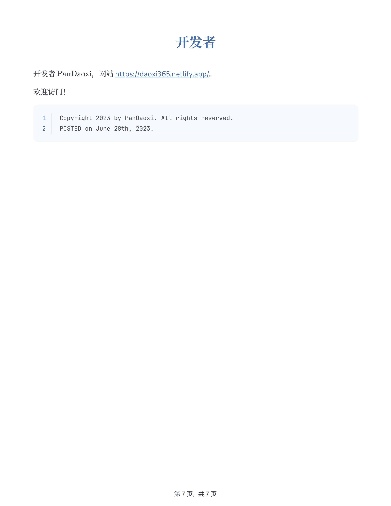

✨由 $\text{PanDaoxi}$ 封装制作的 `Windows 11 x64` 问世！
此版本精简而美观，功能齐全，可自定义化程度高，欢迎使用。

在开始之前，请先仔细阅读自述文件：

下载地址：<https://www.123pan.com/s/njglVv-PxsKA.html>
更多操作系统资源：<https://www.123pan.com/s/njglVv-vJsKA.html>