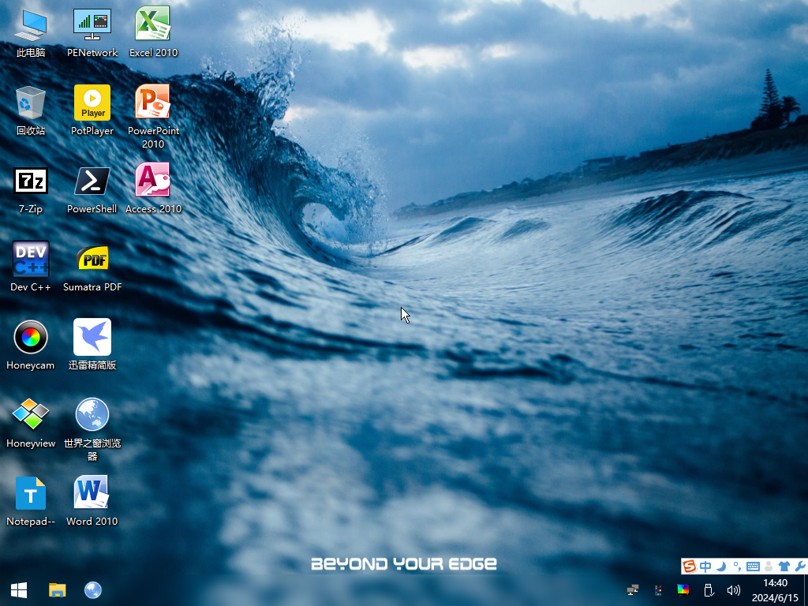
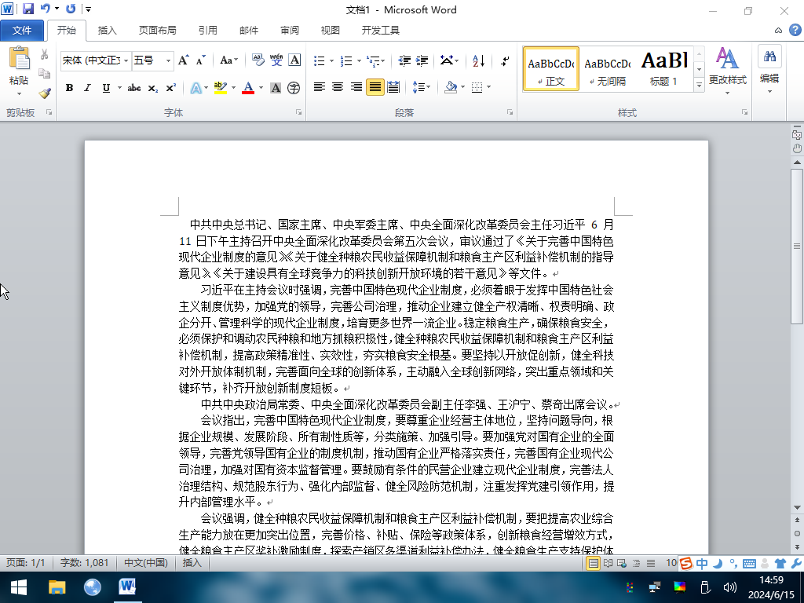
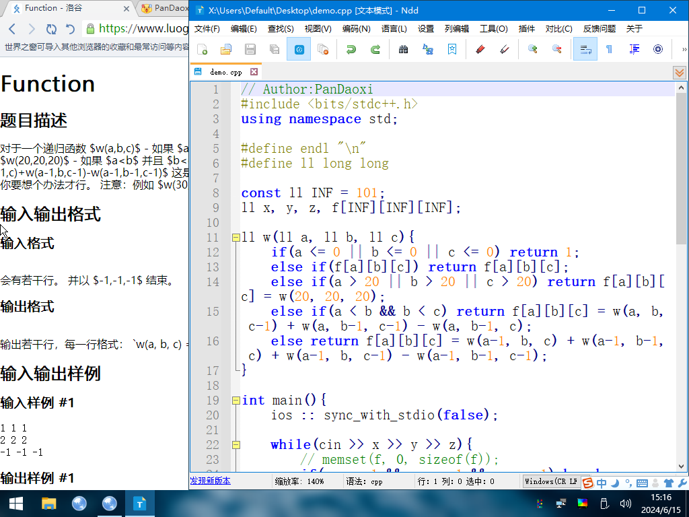
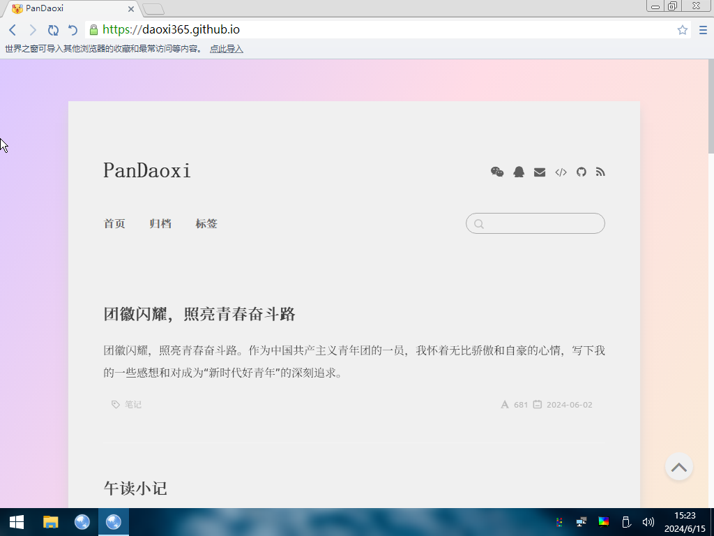
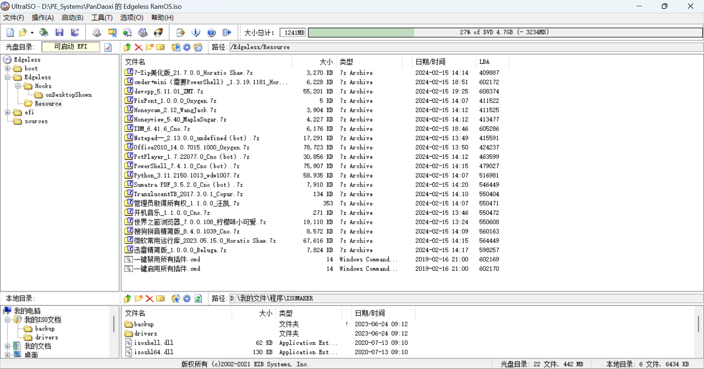

✨由 $\text{PanDaoxi}$ 封装制作的 `Edgeless RAMOS` 问世！
此版本根据 Edgeless 原版进行适度封装和修改，提升了系统的实用性与美观性。
此版本禁止商用和盗版传播。

效果展示：

下载地址：<https://www.123pan.com/s/njglVv-DzCKA.html>
更多操作系统资源：<https://www.123pan.com/s/njglVv-vJsKA.html>

补充：
**RamOS**——*内存操作系统*

什么是内存操作系统？顾名思义，就是全在内存 RAM 内运行，启动后不依赖硬盘的系统。

其实早在 Windows 98 时代我们就接触过，使用 Windows 98 启动光盘启动到 DOS 后会加载一个虚拟的 A 盘，它利用内存虚拟出一个磁盘存放常用的 DOS 工具。时下流行的 WinPE 2.0 系统也是 RAMOS(整个系统封装在一个 WIM 文件中)，启动后会把所有文件加载到内存运行，这样不仅速度快，而且能够更好地保护系统核心文件不受破坏。
在 Win9x/xp 早期 时代，通常采用微软自带的一个 `ramdisk.sys` 驱动，来实现将内存中划分出一块空间来作为磁盘来使用，但是这个方式所映射磁盘一般只能作为逻辑盘来使用，用户可以把系统临时文件或一些小型常用软件放在这个磁盘空间中以提高运行速度，但是想让内存盘可以作为系统盘存放操作系统，则不可以，因为自带的 ramdisk 有很多限制，而且需要在系统引导时，引导核心提供支持，微软自己的 ntldr 无法提供对其支持；
后期显市的 `firadisk32.sys` 是一款开源的内存虚拟盘驱动，其功能方面比 `ramdisk.sys` 有了很大的改进，结合 grub4dos 中的 grldr 作为系统引导核心来管理启动，提供了对 img 镜像启动支持与对 `firadisk32.sys` 的良好支持，我们得以实现真正的操作系统从内存启动运行。